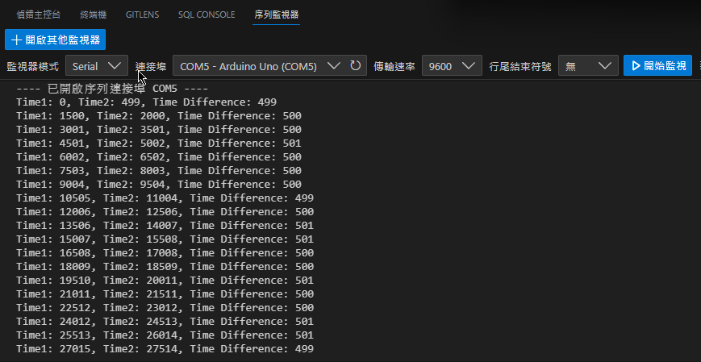

# 0515作業_薛皓陽

<https://github.com/sun92122/NTNU-Arduino-2023-Spring/blob/main/0522/0522%E4%BD%9C%E6%A5%AD-%E8%96%9B%E7%9A%93%E9%99%BD.md>

## HW01 監測時間差

### HW01_code

<https://github.com/sun92122/NTNU-Arduino-2023-Spring/blob/main/0522/MyTime.ino>

```cpp
unsigned long time1;
unsigned long time2;
unsigned long timeDifference; // 時間差

void setup()
{
  Serial.begin(9600);
}

void loop()
{
  Serial.print("Time1: ");
  time1 = millis();
  Serial.print(time1);

  delay(500);

  Serial.print(", Time2: ");
  time2 = millis();
  Serial.print(time2);

  timeDifference = time2 - time1;
  Serial.print(", Time Difference: ");
  Serial.println(timeDifference);

  delay(1000);
}
```

### HW01 執行畫面



## reference

1. (2023). millis() - Arduino Reference. Reference. <https://reference.arduino.cc/reference/en/language/functions/time/millis/>
