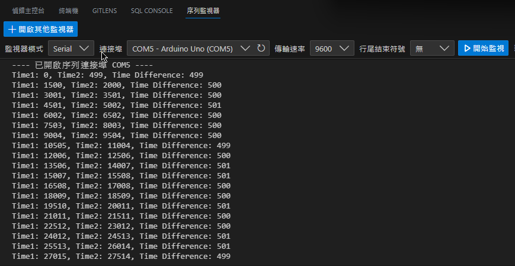

# 0522筆記_薛皓陽

## Source Code

上次忘記調整權限QQ

<https://github.com/sun92122/NTNU-Arduino-2023-Spring/tree/main/0522>

## 數位訊號產生與監測

### DighitalReadSerial

<https://github.com/sun92122/NTNU-Arduino-2023-Spring/tree/main/0522/DighitalReadSerial.ino>

```c++
int push_button = 2;
int button_state = 0;

void setup() {
  // 初始化序列埠
  Serial.begin(9600);
  // 初始化 push_button 為輸入腳位
  pinMode(push_button, INPUT);
}

void loop() {
  // 讀取 push_button 的狀態
  button_state = digitalRead(push_button);

  Serial.println(button_state); // 印出 button_state 的值，並換行

}
```

### Button

<https://github.com/sun92122/NTNU-Arduino-2023-Spring/tree/main/0522/MyButton.ino>

```c++
const int button_pin = 2;
const int led_pin = 13;
int button_state = 0;

void setup()
{
  Serial.begin(9600);
  pinMode(button_pin, INPUT);
  pinMode(led_pin, OUTPUT);
  Serial.println("Setup done.");
}

void loop()
{
  Serial.println("Looping...");
  button_state = digitalRead(button_pin);
  Serial.println(button_state);

  // 如果按鈕被按下，就點亮 LED 燈
  if (button_state == HIGH)
  {
    digitalWrite(led_pin, HIGH);
  }
  else
  {
    digitalWrite(led_pin, LOW);
  }
}
```

## HW01 監測時間差

### HW01_code

<https://github.com/sun92122/NTNU-Arduino-2023-Spring/blob/main/0522/MyTime.ino>

```cpp
unsigned long time1;
unsigned long time2;
unsigned long timeDifference; // 時間差

void setup()
{
  Serial.begin(9600);
}

void loop()
{
  Serial.print("Time1: ");
  time1 = millis();
  Serial.print(time1);

  delay(500);

  Serial.print(", Time2: ");
  time2 = millis();
  Serial.print(time2);

  timeDifference = time2 - time1;
  Serial.print(", Time Difference: ");
  Serial.println(timeDifference);

  delay(1000);
}
```

### HW01 執行畫面



### reference

1. 辭典檢視 [埠 : ㄅㄨˋ] - 教育部《重編國語辭典修訂本》2021. Dict. <https://dict.revised.moe.edu.tw/dictView.jsp?ID=579&la=0&powerMode=0>
