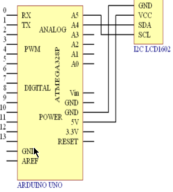

# 0515筆記_薛皓陽

## Source Code

<https://github.com/sun92122/NTNU-Arduino-2023-Spring/tree/main/0529>

## 反應時間

### 反應時間_Code

<https://github.com/sun92122/NTNU-Arduino-2023-Spring/blob/main/0529/ReactionTime.ino>

```c
// 宣告區
// 常數不變
const int buttonPin = 2; // 按鈕開關訊號插孔為 2 號
const int ledPin = 13;   // LED 插孔為 2 號
// 變數會改變
int buttonState = 0;         // 開關訊號狀態初值為零
int randomTime;              // 亂數時間
unsigned long time1;         // 時間 1(紅燈亮時)
unsigned long time2;         // 時間 2(啟動剎車時)
unsigned long reactionTime;  // 反應時間

void setup()
{
  pinMode(ledPin, OUTPUT);   // 設定 ledPin 為 OUTPUT
  pinMode(buttonPin, INPUT); // 設定 buttonPin 為 INPUT
  Serial.begin(9600);        // 設定序列埠監視幕
  // 隨機點亮 LED
  Serial.println("When the RED light is on, press the BRAKE"); // 印紅燈警語
  randomTime = random(1000, 10000);                            // 擷取亂數時間
  delay(randomTime);                                           // 延遲亂數時間
  digitalWrite(ledPin, HIGH);                                  // 向 ledPin 輸出 HIGH(點亮 LED)
  time1 = millis();                                            // 擷取亮燈時間存於 time1
  Serial.print("Time1: ");                                     // 印字 Time1:
  Serial.println(time1);                                       // 印變數 time1 之值
}

void loop()
{
  buttonState = digitalRead(buttonPin); // 讀取 buttonPin 狀態存於 buttonState
  // 起初為 LOW, 按下開關, buttonState 變為 HIGH:
  if (buttonState == HIGH)                     // 如果 buttonState 等於 HIGH(按下)
  {                                            // 如果執行區開頭
    Serial.print("buttonState = ");            // 印字
    Serial.println(buttonState);               // 印變數 buttonState 之值
    Serial.print("Time2: ");                   // 印字
    time2 = millis();                          // 擷取剎車時間存於 time2
    Serial.println(time2);                     // 印變數 time2 之值
    reactionTime = time2 - time1;              // 計算時間差存入 reactionTime
    Serial.println("Button has been pressed"); // //印字 開關已按
    Serial.print("Your reaction time = ");     // 印字
    Serial.print(reactionTime);                // 印變數 reactionTime 之值
    Serial.println(" ms");                     // 印字
    digitalWrite(ledPin, LOW);                 // 向 ledPin 輸出 LOW(LED 暗)
    delay(100000);                             // 延遲 10 分鐘 (任務完成，等待下次啟動)
  }                                            // 如果執行區結尾
}
```

## LCD1602

### 連接



### LCD1602_Code

<https://github.com/sun92122/NTNU-Arduino-2023-Spring/blob/main/0529/Blink-I2C.ino>

```c
#include <LiquidCrystal_I2C.h>

LiquidCrystal_I2C lcd(0x27, 2, 1, 0, 4, 5, 6, 7, 3, POSITIVE);

void setup()
{
  lcd.begin(16, 2);

  lcd.print("Hello, world!");
}

void loop()
{
  lcd.noBlink();

  delay(3000);

  lcd.blink();
  delay(3000);
}
```
